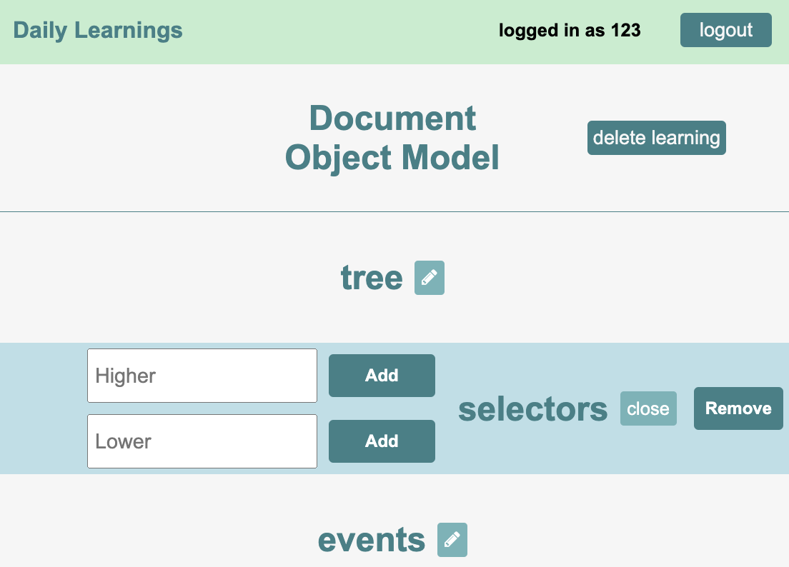

# Daily Learnings

- Aim
- Design Phase
- Data model & Database 

### Aim

The aim of this project was to build a RESTful CRUD web application that allows users to create notes on a topic they are learning. This was the second project that I completed during the Software Engineering Intensive course at General Assembly.

### Design Phase

There is a natural heirachy within any concept. For example, when I started learning JavaScript I studied the concept of asynchronous programming. This concept was be broken up into smaller concepts that can be ordered.

### Data model & Database

The design required a data model that allowed strings stored together in a order. Array's have the required features of order and encapsulation. Therefore, Arrays were used to store an ordered set of concepts together. Two tables were created this project. One table held the user information and the other held the learning data. Each user had a unique id and earch learning had a unque id.